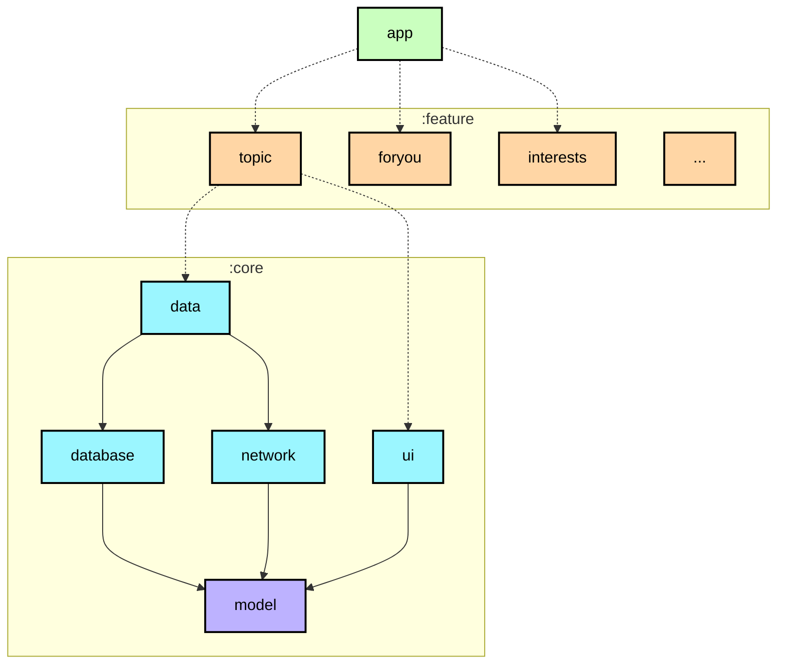
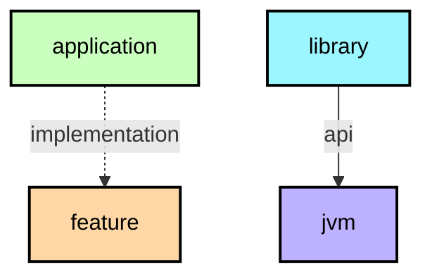

# Modularization learning journey
# 模块化学习之旅

In this learning journey you will learn about modularization, and the modularization strategy used
to create the modules in the Now in Android app.

在本次学习之旅中，您将了解模块化，以及用于在Now In Android应用程序中创建模块的模块化策略。

## Overview
## 概述

Modularization is the practice of breaking the concept of a monolithic, one-module codebase into
loosely coupled, self contained modules.

模块化是将单模块代码库的概念分解为松散耦合的、自包含模块的实践。

### Benefits of modularization
### 模块化的好处

This offers many benefits, including:

这提供了许多好处，包括：

**Scalability** - In a tightly coupled codebase, a single change can trigger a cascade of
alterations. A properly modularized project will embrace
the [separation of concerns](https://en.wikipedia.org/wiki/Separation_of_concerns) principle. This
in turn empowers the contributors with more autonomy while also enforcing architectural patterns.

**可扩展性** - 在紧密耦合的代码库中，单个更改可以触发一连串更改。一个适当的模块化项目将采用[关注点分离](https://en.wikipedia.org/wiki/Separation_of_concerns) 原则。这反过来又赋予了贡献者更多的自主权，同时也强化了架构模式。

**Enabling work in parallel** - Modularization helps decrease version control conflicts and enables
more efficient work in parallel for developers in larger teams.

**启用并行工作** - 模块化有助于减少版本控制冲突，并为大型团队中的开发人员提供更高效的并行工作。

**Ownership** - A module can have a dedicated owner who is responsible for maintaining the code and
tests, fixing bugs, and reviewing changes.

**所有权** - 模块可以有一个专门的所有者，他负责维护代码和测试、修复bug和审查更改。

**Encapsulation** - Isolated code is easier to read, understand, test and maintain.

**封装** - 隔离的代码更容易阅读、理解、测试和维护。

**Reduced build time** - Leveraging Gradle’s parallel and incremental build can reduce build times.

**减少构建时间** - 利用 Gradle 的并行和增量构建可以减少构建时间。

**Dynamic delivery** - Modularization is a requirement
for [Play Feature Delivery](https://developer.android.com/guide/playcore/feature-delivery) which
allows certain features of your app to be delivered conditionally or downloaded on demand.

**动态交付** - 模块化是[Play Feature delivery](https://developer.android.com/guide/playcore/feature-delivery)的一个要求，它允许你的应用程序的某些功能有条件地交付或按需下载。

**Reusability** - Proper modularization enables opportunities for code sharing and building multiple
apps, across different platforms, from the same foundation.

**可重用性** - 适当的模块化提供了在同一基础上跨不同平台共享代码和构建多个应用程序的机会。

### Modularization pitfalls
### 模块化陷阱

However, modularization is a pattern that can be misused, and there are some gotchas to be aware of
when modularizing an app:

然而，模块化是一种可能被滥用的模式，并且在模块化应用程序时需要注意一些问题:

**Too many modules** - each module has an overhead that comes in the form of increased complexity of
the build configuration. This can cause Gradle sync times to increase, and incurs an ongoing
maintenance cost. In addition, adding more modules increases the complexity of the project’s Gradle
setup, when compared to a single monolithic module. This can be mitigated by making use of
convention plugins, to extract reusable and composable build configuration into type-safe Kotlin
code. In the Now in Android app, these convention plugins can be found in
the [`build-logic` folder](https://github.com/android/nowinandroid/tree/main/build-logic).

**模块太多** - 每个模块都有开销，其形式是增加构建配置的复杂性。这可能会导致Gradle同步时间增加，并产生持续的维护成本。
此外，与单个整体模块相比，添加更多模块会增加项目Gradle设置的复杂性。这可以通过使用约定插件来缓解，将可重用和可组合的构建配置提取到类型安全的Kotlin代码中。
在Now In Android应用程序中，这些约定插件可以在[`build-logic` 文件夹](https://github.com/android/nowinandroid/tree/main/build-logic)中找到。

**Not enough modules** - conversely if your modules are few, large and tightly coupled, you end up
with yet another monolith. This means you lose some benefits of modularization. If your module is
bloated and has no single, well defined purpose, you should consider splitting it.

**没有足够的模块** - 相反，如果你的模块很少、很大并且紧密耦合，你最终会得到另一个庞然大物。这意味着您失去了模块化的一些好处。如果你的模块是臃肿且没有单一的、明确的目的，你应该考虑将其拆分。

**Too complex** - there is no silver bullet here. In fact it doesn’t always make sense to modularize
your project. A dominating factor is the size and relative complexity of the codebase. If your
project is not expected to grow beyond a certain threshold, the scalability and build time gains
won’t apply.

**太复杂** - 这里没有灵丹妙药。事实上，将项目模块化并不总是有意义的。一个主要因素是代码库的大小和相对复杂性。如果你的项目预计不会增长超过一定阈值，那么可扩展性和构建时间收益将不适用。

## Modularization strategy
## 模块化策略

It’s important to note that there is no single modularization strategy that fits all projects.
However, there are general guidelines that can be followed to ensure you maximize its benefits and
minimize its downsides.

需要注意的是，没有一种模块化策略适合所有项目。然而，有一些通用的指导方针可以遵循，以确保您最大限度地发挥其优势，并尽量减少其缺点。

A barebone module is simply a directory with a Gradle build script inside. Usually though, a module
will consist of one or more source sets and possibly a collection of resources or assets. Modules
can be built and tested independently. Due to Gradle's flexibility there are few constraints as to
how you can organize your project. In general, you should strive for low coupling and high cohesion.

准系统模块只是一个内部包含 Gradle 构建脚本的目录。但通常情况下，一个模块将由一个或多个source源集以及可能的resources资源或assets资产的集合组成。模块可以独立构建和测试。由于 Gradle 的灵活性，在如何组织项目方面几乎没有限制。一般来说，您应该努力实现低耦合和高内聚。

* **Low coupling** - Modules should be as independent as possible from one another, so that changes
  to one module have zero or minimal impact on other modules. They should not possess knowledge of
  the inner workings of other modules.

* **低耦合** - 模块应尽可能相互独立，这样对一个模块的更改对其他模块的影响为零或最小。他们不应该了解其他模块的内部工作原理。

* **High cohesion** - A module should comprise a collection of code that acts as a system. It should
  have clearly defined responsibilities and stay within boundaries of certain domain knowledge. For
  example,
  the [`core:network` module](https://github.com/android/nowinandroid/tree/main/core/network) in Now
  in Android is responsible for making network requests, handling responses from a remote data
  source, and supplying data to other modules.

* **高内聚** - 模块应该包含一组充当系统的代码。它应该有明确定义的职责，并保持在某些领域知识的范围内。例如，Now in Android中的[`core:network` 模块](https://github.com/android/nowinandroid/tree/main/core/network)负责发出网络请求，处理来自远程数据源的响应，并向其他模块提供数据。

## Types of modules in Now in Android
## Now in Android 中的模块类型

📋 Graph legend

**Top tip**: A module graph (shown above) can be useful during modularization planning for
visualizing dependencies between modules.

重要提示：模块图（如上所示）在模块化规划期间非常有用，可用于可视化模块之间的依赖关系。

The Now in Android app contains the following types of modules:

Now in Android应用包含以下类型的模块：

* The `app` module - contains app level and scaffolding classes that bind the rest of the codebase,
  such as `MainActivity`, `NiaApp` and app-level controlled navigation. A good example of this is
  the navigation setup through `NiaNavHost` and the bottom navigation bar setup
  through `TopLevelDestination`. The `app` module depends on all `feature` modules and
  required `core` modules.

* `app`模块 - 包含应用级和脚手架类，它们绑定了其余的代码库，比如`MainActivity`、`NiaApp`和应用级控制导航。一个很好的例子是通过`NiaNavHost`设置导航，通过`TopLevelDestination`设置底部导航栏。`app`模块依赖于所有的`feature`模块和必需的`core`模块。

* `feature:` modules - feature specific modules which are scoped to handle a single responsibility
  in the app. These modules can be reused by any app, including test or other flavoured apps, when
  needed, while still keeping it separated and isolated. If a class is needed only by one `feature`
  module, it should remain within that module. If not, it should be extracted into an
  appropriate `core` module. A `feature` module should have no dependencies on other feature
  modules. They only depend on the `core` modules that they require.

* `feature:`模块 - 特定于feature功能的模块，其作用域为处理应用程序中的单个职责。任何app应用（包括测试应用或其他风格的应用）都可以在需要时重用这些模块，同时仍保持其分离和隔离。如果一个类只被一个`feature`模块需要，它应该留在那个模块中。如果没有，则应将其提取到适当的`core`模块中。一个`feature`模块不应该依赖于其他的feature模块。它们只依赖于所需的`core`模块。

* `core:` modules - common library modules containing auxiliary code and specific dependencies that
  need to be shared between other modules in the app. These modules can depend on other core
  modules, but they shouldn’t depend on feature nor app modules.

* `core:`模块 - 包含辅助代码和特定依赖关系的公共库模块，它们需要在应用中的其他模块之间共享。这些模块可以依赖于其他core模块，但它们不应该依赖于feature模块或app模块。

* Miscellaneous modules - such as `sync`, `benchmark` and `test` modules, as well
  as `app-nia-catalog` - a catalog app for displaying our design system quickly.

* 其他模块 - 例如`sync`, `benchmark` 和 `test` 模块，以及`app-nia-catalog`- 一个目录应用程序，用于快速显示我们的设计系统。

## Modules
## 模块

Using the above modularization strategy, the Now in Android app has the following modules:

使用上述模块化策略，Now in Android应用具有以下模块：

<table>
  <tr>
   <td><strong>Name（名字）</strong>
   </td>
   <td><strong>Responsibilities（职责）</strong>
   </td>
   <td><strong>Key classes and good examples（关键的类和好的例子）</strong>
   </td>
  </tr>
  <tr>
   <td><code>app</code>
   </td>
   <td>Brings everything together required for the app to function correctly. This includes UI scaffolding and navigation. 

将app正常运行所需的所有内容汇集在一起。这包括UI脚手架和导航。
   </td>
   <td><code>NiaApp, MainActivity</code> 
   App-level controlled navigation via <code>NiaNavHost, NiaAppState, TopLevelDestination</code>
   </td>
  </tr>
  <tr>
   <td><code>feature:1,</code> 
   <code>feature:2</code> 
   ...
   </td>
   <td>Functionality associated with a specific feature or user journey. Typically contains UI components and ViewModels which read data from other modules. 

与特定功能或用户旅程相关的功能。通常包含UI组件和从其他模块读取数据的ViewModels。

   Examples include: 
   <ul>
      <li><a href="https://github.com/android/nowinandroid/tree/main/feature/topic"><code>feature:topic</code></a> displays information about a topic on the TopicScreen.</li>
      <li><a href="https://github.com/android/nowinandroid/tree/main/feature/foryou"><code>feature:foryou</code></a> which displays the user's news feed, and onboarding during first run, on the For You screen.</li>
      </ul>
   </td>
   <td><code>TopicScreen</code> 
   <code>TopicViewModel</code>
   </td>
  </tr>
  <tr>
   <td><code>core:data</code>
   </td>
   <td>Fetching app data from multiple sources, shared by different features.

从多个来源获取应用数据，由不同的features共享。
   </td>
   <td><code>TopicsRepository</code> 
   </td>
  </tr>
  <tr>
   <td><code>core:designsystem</code>
   </td>
   <td>Design system which includes Core UI components (many of which are customized Material 3 components), app theme and icons. The design system can be viewed by running the <code>app-nia-catalog</code> run configuration. 

设计系统，包括核心UI组件（其中许多是定制的Material3组件），应用主题和图标。设计系统可以通过运行app-nia-catalog运行配置来查看。
   </td>
   <td>
   <code>NiaIcons</code>    <code>NiaButton</code>    <code>NiaTheme</code> 
   </td>
  </tr>
  <tr>
   <td><code>core:ui</code>
   </td>
   <td>Composite UI components and resources used by feature modules, such as the news feed. Unlike the <code>designsystem</code> module, it is dependent on the data layer since it renders models, like news resources. 

功能模块（如新闻提要）使用的组合UI组件和资源。与designsystem模块不同，它依赖于数据层，因为它呈现models，就像新闻资源一样。
   </td>
   <td> <code>NewsFeed</code> <code>NewsResourceCardExpanded</code>
   </td>
  </tr>
  <tr>
   <td><code>core:common</code>
   </td>
   <td>Common classes shared between modules.

模块之间共享的公共类。
   </td>
   <td><code>NiaDispatchers</code> 
   <code>Result</code>
   </td>
  </tr>
  <tr>
   <td><code>core:network</code>
   </td>
   <td>Making network requests and handling responses from a remote data source.

发出网络请求并处理来自远程数据源的响应。
   </td>
   <td><code>RetrofitNiaNetworkApi</code>
   </td>
  </tr>
  <tr>
   <td><code>core:testing</code>
   </td>
   <td>Testing dependencies, repositories and util classes.

测试依赖项、存储库和util类。
   </td>
   <td><code>NiaTestRunner</code> 
   <code>TestDispatcherRule</code>
   </td>
  </tr>
  <tr>
   <td><code>core:datastore</code>
   </td>
   <td>Storing persistent data using DataStore.

使用DataStore存储持久数据。
   </td>
   <td><code>NiaPreferences</code> 
   <code>UserPreferencesSerializer</code>
   </td>
  </tr>
  <tr>
   <td><code>core:database</code>
   </td>
   <td>Local database storage using Room.

使用Room存储本地数据库。
   </td>
   <td><code>NiaDatabase</code> 
   <code>DatabaseMigrations</code> 
   <code>Dao</code> classes
   </td>
  </tr>
  <tr>
   <td><code>core:model</code>
   </td>
   <td>Model classes used throughout the app.

整个应用程序使用的Model模型类。
   </td>
   <td><code>Topic</code> 
   <code>Episode</code> 
   <code>NewsResource</code>
   </td>
  </tr>
</table>

Each module has its own `README.md` file containing a module graph (e.g. [`:app` module graph](../app/README.md#module-dependency-graph)).  
When modules dependencies change, module graphs are automatically updated by the [Build.yaml](../.github/workflows/Build.yaml) workflow.  
You can also manually update the graphs by running the `graphUpdate` task.

## Modularization in Now in Android
## Now in Android中的模块化

Our modularization approach was defined taking into account the “Now in Android” project roadmap, upcoming work and new features. Additionally, our aim this time around was to find the right balance between overmodularizing a relatively small app and using this opportunity to showcase a modularization pattern fit for a much larger codebase, closer to real world apps in production environments.

我们的模块化方法是根据“现在在Android”的项目路线图、即将开展的工作和新功能来定义的。此外，我们这次的目标是在过度模块化相对较小的应用程序和利用这个机会展示适合更大代码库的模块化模式之间找到适当的平衡，更接近生产环境中的实际应用程序。

This approach was discussed with the Android community, and evolved taking their feedback into account. With modularization however, there isn’t one right answer that makes all others wrong. Ultimately, there are many ways and approaches to modularizing an app and rarely does one approach fit all purposes, codebases and team preferences. This is why planning beforehand and taking into account all goals, problems you’re trying to solve, future work and predicting potential stepping stones are all crucial steps for defining the best fit structure under your own, unique circumstances. Developers can benefit from a brainstorming session to draw out a graph of modules and dependencies to visualize and plan this better.

我们与Android社区讨论了这种方法，并根据他们的反馈进行了改进。然而，对于模块化，没有一个正确的答案会使其他所有的答案都是错误的。最终，有许多方法和方法可以模块化应用程序，很少有一种方法适合所有目的、代码库和团队偏好。这就是为什么提前计划，考虑到所有的目标，你想要解决的问题，未来的工作和预测潜在的垫脚石都是在你自己独特的情况下定义最适合的结构的关键步骤。开发人员可以从头脑风暴会议中受益，以绘制模块和依赖关系的图表，从而更好地可视化和规划。

Our approach is such an example - we don’t expect it to be an unchangeable structure applicable to all cases, and in fact, it could evolve and change in the future. It’s a general guideline we found to be the best fit for our project and offer it as one example you can further modify, expand and build on top of. One way of doing this would be to increase the granularity of the codebase even more. Granularity is the extent to which your codebase is composed of modules. If your data layer is small, it’s fine to keep it in a single module. But once the number of repositories and data sources starts to grow, it might be worth considering splitting them into separate modules.

我们的方法就是这样一个例子——我们并不期望它是一个适用于所有情况的不可改变的结构，事实上，它可能在未来发展和改变。我们发现这是一个最适合我们项目的通用指导原则，并将其作为一个示例，您可以在此基础上进一步修改、扩展和构建。这样做的一种方法是进一步增加代码库的粒度。粒度是指代码库由模块组成的程度。如果您的数据层很小，可以将其保存在单个模块中。但是，一旦存储库和数据源的数量开始增长，就应该考虑将它们拆分为单独的模块。

We are also always open to your constructive feedback - learning from the community and exchanging ideas is one of the key elements to improving our guidance.

我们也总是对你的建设性反馈持开放态度——从社区中学习和交换意见是改进我们指导的关键因素之一。
